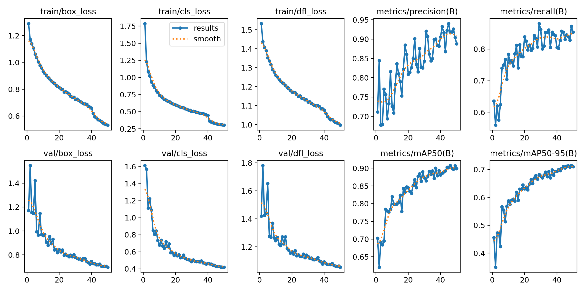
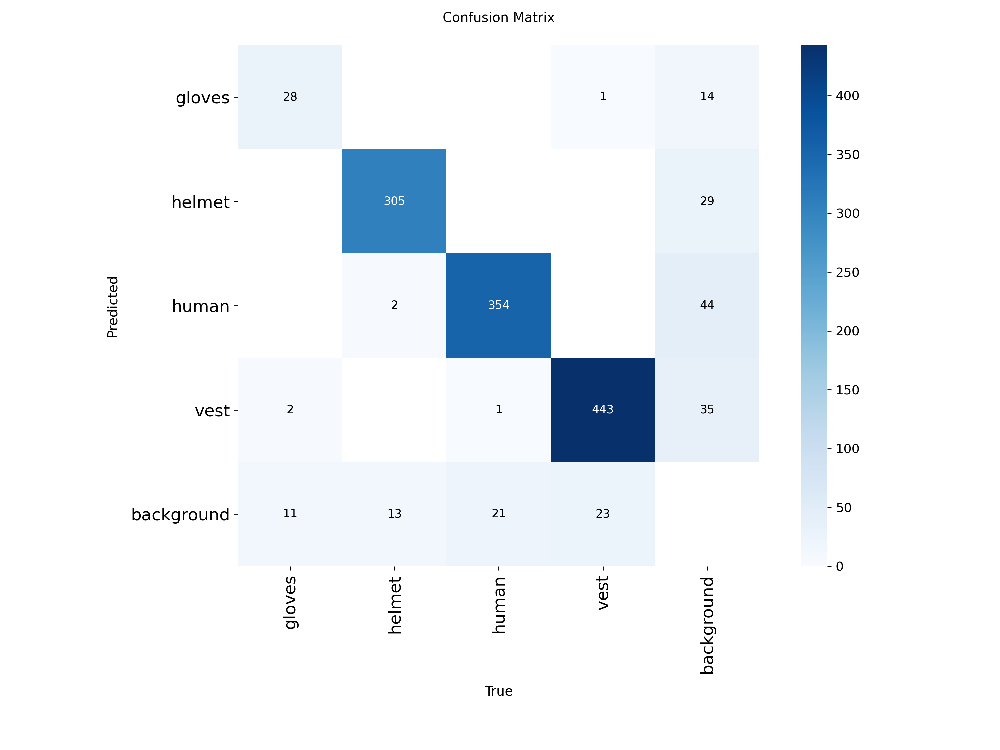
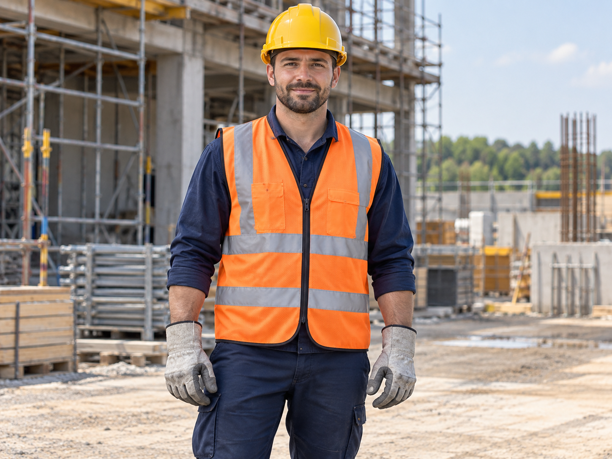
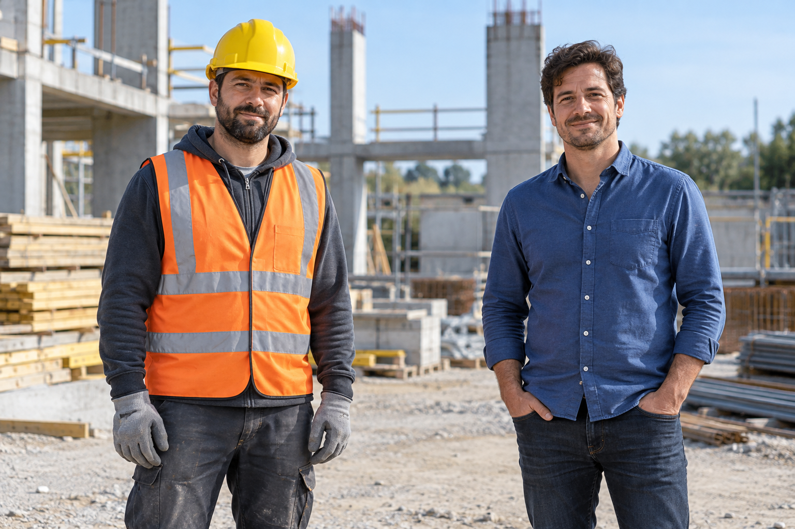

# PPE Detection System — Computer Vision

An end-to-end object detection pipeline that identifies personal protective equipment (PPE) — gloves, helmets, and vests — along with worker presence in construction site imagery, built to help flag safety-equipment compliance from images.

## Overview

This project covers the full ML pipeline: sourcing and cleaning a public dataset, training an object detection model, evaluating performance, and iterating based on results. It was built as a hands-on exploration of applied computer vision for real-world safety use cases.

## Tech Stack

- **Model:** YOLOv8 (Ultralytics)
- **Framework:** PyTorch
- **Image processing:** OpenCV
- **Training environment:** Google Colab (GPU-accelerated, T4)
- **Dataset source:** Roboflow — public "Construction Worker" dataset

## Dataset & Preprocessing

- Sourced a public construction-site PPE dataset from Roboflow.
- Audited class distribution and found one category too sparse to train on reliably; removed it and consolidated the dataset down to **four classes** to keep training stable and results meaningful.
- Preprocessed and augmented data for GPU training.

## Training

- Trained using YOLOv8 on a GPU-accelerated Colab runtime.
- Tracked performance using **mean Average Precision (mAP)** across training runs.
- Final model achieves **[INSERT FINAL mAP]** mAP on the validation set.
- Mid-project, a Colab session disconnect caused the loss of a trained model's weights — the training pipeline was rebuilt and retraining completed successfully, which reinforced the importance of checkpointing in iterative training workflows.

## Results

**Training performance:**



**Confusion matrix:**



**Sample detections:**




## What I'd Improve Next

- Expand the dataset to cover more PPE categories (e.g., eye protection, hearing protection)
- Experiment with YOLOv11 for a potential accuracy/speed comparison
- Add real-time video inference support
- Deploy as a lightweight web demo (e.g., Streamlit or a simple Flask app)

## Repository Structure

```
├── ppe.ipynb              # Full training & evaluation notebook
├── best.pt                 # Trained model weights
├── assets/
│   ├── results.png         # Training curves (loss, precision, recall, mAP)
│   ├── confusion_matrix.png
│   └── demo/                # Sample detection outputs
└── README.md
```

## Setup

```bash
git clone https://github.com/rheamalpekar/PPE-Detection.git
cd PPE-Detection
pip install ultralytics opencv-python
```

## Usage

Open `ppe.ipynb` in Jupyter or Colab to see the full pipeline, or run inference directly with the trained weights:

```python
from ultralytics import YOLO

model = YOLO("best.pt")
results = model("path/to/image.jpg")
results[0].show()
```

## Author

**Rhea Malpekar**
M.S. Computer Science, University of Texas at Arlington
[GitHub](https://github.com/rheamalpekar) · [LinkedIn](#)